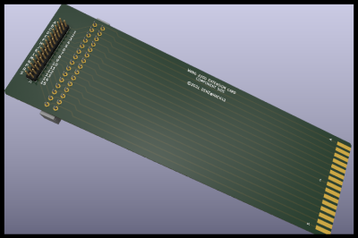
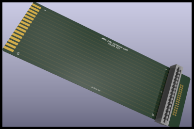

# Extension card

I've created an extension card to be able to raise the the processor and interface cards out of the card cage. The boards are 8" (203.20 mm) long and 2.50" (63.5 mm) wide. In total three extension cards are needed for a full processor board, and two for an interface card, or the power regulator card.

## Features

- The card is raised outside the card cage and rotated 90 degrees (component side up). That makes it easy to probe signals with a multimeter or oscilloscope.
- A standard 2x15 0.1" header is provided that connects to all connection points on the card edge, for easy attachment of logic analyzer probes

## Design

The PCB is designed in [KiCad], and the gerbers were sent to [JLCPCB] for manufacturing. The boards came back nice and have been used to check the power supply.

## Parts

- J1: Male card edge (not really a physical part)
- J2: Female card edge connector EDAC 307-030-520-201 [Datasheet] [Mouser]
- J3: Male pin header (2x15)

----
 \
Alex van Denzel denz@hack42.nl

[KiCad]: https://www.kicad.org/
[JLCPCB]: https://jlcpcb.com/
[Datasheet]: ../../documentation/307-030-520-201%20-%20EDAC%20Card%20Edge%20Connector.pdf
[Mouser]: https://nl.mouser.com/ProductDetail/EDAC/307-030-520-201?qs=aCtAaaGuzsYJID3KFF7AAw%3D%3D
